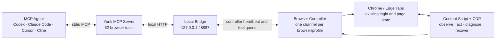

<div align="center">

# Yunti Browser Runtime

**让 AI Agent 稳定操作你正在使用的 Chrome / Edge。**

本地优先 · MCP 原生 · Content Script + CDP 双通道 · 无远程账号依赖

[](https://www.npmjs.com/package/yunti-browser-runtime)
[](package.json)
[](docs/TOOL_GUIDE.md)
[](LICENSE)

[快速开始](#快速开始) · [核心能力](#核心能力) · [工作原理](#工作原理) · [交给-agent-安装](#交给-agent-安装) · [文档](#文档导航)

</div>

Yunti Browser Runtime 是一个面向 MCP Agent 的本地浏览器运行时。它把 Agent、
本地 Bridge 和浏览器扩展连接起来，让 Codex、Claude Code、Cursor、Cline 等工具
能够观察和操作用户真实浏览器中的页面。

> English: A local-first MCP browser runtime that lets AI agents inspect and
> operate the user's existing Chromium browser through a local bridge and
> extension, with no hosted account or remote browser required.

## 为什么是 Yunti

很多浏览器自动化方案需要启动一套独立浏览器、上传会话到云端，或要求 Agent 自己
处理易失效的页面选择器。Yunti 选择另一条路径：让 Agent 安全接入用户已经登录、
已经打开的本地浏览器，同时把页面恢复和执行诊断做成运行时能力。

| 关注点 | Yunti 的选择 |
| --- | --- |
| 浏览器 | 操作用户本机 Chrome / Edge 和已有登录状态 |
| 接入协议 | 标准 MCP，和具体 Agent 平台解耦 |
| 操作后端 | Content Script 与 Chrome DevTools Protocol 都是一等能力 |
| 页面定位 | observe → fresh uid → action → verify，并保留 selector / coordinate / CDP 回退 |
| 会话稳定性 | 每个浏览器实例一条 controller 通道，旧 session、睡眠标签和 MV3 恢复由 runtime 处理 |
| 数据边界 | Bridge 默认只监听 `127.0.0.1`，无远程服务、无平台账号、默认无 token |
| Agent 行为 | 结构化错误、共享重试预算、写操作不确定性与恢复建议 |

### 0.2.7 页面无侵入热修复

`0.2.7` 移除了扩展注入业务页面的 `AI` 悬浮按钮和“刷新连接”面板。后台
controller、自动注册、MCP 页面操作、Content Script 与 CDP 能力保持不变；连接状态
仍可从浏览器工具栏的扩展 popup 查看。详细说明见
[0.2.7 发布说明](docs/RELEASE_0_2_7.md)。

### 0.2.6 可靠性基线

`0.2.6` 用 38 个确定性复杂场景和真实 Edge 15 分钟耐久测试验证动态页面能力。
benchmark 通过 `38/38` 场景、`114` 次尝试和 `397` 次 MCP 调用；Edge 连续运行
`900.168` 秒，完成 `840` 个业务循环和 `22,410/22,410` 次成功工具调用，覆盖
全部 `52/52` 个 MCP 工具，重复写入为 `0`，调用 p95 / max 为 `213 / 956 ms`。

[查看耐久测试设计与完整验收标准](docs/SOAK_TEST.md)

## 快速开始

### 1. 安装 Runtime

要求 Node.js 22 或更高版本：

```bash
npm install -g yunti-browser-runtime
```

本地默认不需要 npm token，也不需要 Yunti 账号。

### 2. 接入你的 Agent

推荐使用 setup 一次完成可安全自动化的本地接入，并打印 MCP 配置：

```bash
yunti-browser-runtime setup --agent codex
```

它会幂等安装 Codex skill；不会覆盖已有的自定义 skill，也不会擅自改写 Agent
私有配置。对 Claude Code、Cursor、Cline 使用 `--no-skill`，把输出的 MCP
配置加入对应 Agent：

```bash
yunti-browser-runtime setup --agent claude-code --no-skill
yunti-browser-runtime setup --agent cursor --no-skill
yunti-browser-runtime setup --agent cline --no-skill
```

支持的 `--agent` 示例：`codex`、`claude-code`、`cursor`、`cline`。把输出的 MCP
配置加入 Agent 后，新建或重载 Agent 会话。Agent 启动 MCP server 时会自动启动
本地 Bridge，通常不需要另开一个 `bridge` 进程。需要只读预览时使用
`yunti-browser-runtime setup --agent codex --check-only`。

### 3. 加载浏览器扩展

获取扩展目录：

```bash
echo "$(npm root -g)/yunti-browser-runtime/extension"
```

然后完成一次浏览器侧加载：

1. Chrome 打开 `chrome://extensions`，Edge 打开 `edge://extensions`。
2. 开启“开发者模式”。
3. 点击“加载已解压的扩展程序”。
4. 选择上面输出的 `extension` 目录。

Chrome / Edge 不允许 npm 静默安装未上架扩展，因此这一步需要用户在浏览器中确认。
加载完成后，扩展会自动连接 `http://127.0.0.1:48887`、维护 controller 心跳并按需
接入可访问页面。默认不需要填写 token、打开 popup、保存设置或手动刷新页面。

### 4. 验证连接

```bash
yunti-browser-runtime status
```

`status` 会把状态分成 `page_ready`、`controller_online`、`runtime_ready`、
`bridge_offline` 和 `version_mismatch` 等层级；需要完整 JSON 时使用
`yunti-browser-runtime status --json`，需要把未就绪当作 shell 失败时加
`--strict`。看到 runtime、Bridge、extension/controller 版本一致后，让 Agent 调用：

```text
yunti_list_browser_targets
```

Agent 应能看到 Chrome / Edge 的可访问标签页，并可直接使用 `tabId`、`targetId` 或
`browserSessionId` 开始操作。

## 交给 Agent 安装

不想自己逐步配置时，把下面整段复制给 Agent：

<details>
<summary><strong>展开安装引导提示词</strong></summary>

```text
请帮我安装并接入 Yunti Browser Runtime。它是一个本地浏览器运行时，让你通过 MCP 操作我本机 Chrome/Edge 页面。

请按步骤引导并尽可能替我执行命令，不要跳步：

1. 确认本机有 Node.js 22+。
2. 执行：npm install -g yunti-browser-runtime
3. 执行：yunti-browser-runtime setup --agent 当前Agent名称；Codex 可让它自动安装 skill，其他 Agent 使用 --no-skill 并根据输出加入 MCP 配置。
4. 根据 setup 输出把 MCP server 配置加入当前 Agent；不要擅自覆盖 Agent 已有的其他 MCP 配置。
5. 告诉我 MCP server 会自动启动本地 Bridge，一般不需要单独运行 bridge。
6. 输出扩展目录：$(npm root -g)/yunti-browser-runtime/extension
7. 只有浏览器“加载已解压的扩展程序”这一步需要我确认：引导我打开 chrome://extensions 或 edge://extensions，开启开发者模式并选择该目录。
8. 告诉我默认 Bridge URL 是 http://127.0.0.1:48887，本地默认不需要 token，不需要打开 popup、保存设置或刷新页面。
9. 执行：yunti-browser-runtime status；需要完整诊断时再执行 yunti-browser-runtime doctor。
10. status 至少达到 controller_online 后调用 yunti_list_browser_targets；选择目标页面并调用 yunti_get_page_snapshot 或 yunti_observe_page 验证控制能力。

不要遗漏 packaged skill 的安装或接入。不要覆盖已有 Agent 配置，不要默认要求我刷新页面、切换标签、重启浏览器或填写 token。页面路由异常时先使用 controller、tabId/targetId 和结构化 recoveryAction 自动恢复；只有浏览器明确阻止注入且自动恢复失败时，才请求我处理。
```

</details>

## 核心能力

### 观察与定位

- 获取全部浏览器实例、标签页和 targets。
- 读取轻量页面上下文、完整元素快照和可交互 DOM 观察结果。
- 为每次观察生成独立作用域的 fresh uid，重渲染后旧 uid 不会误命中新元素。
- 支持开放 Shadow DOM、同源 iframe、滚动容器、深层等待和增量观察。
- 对网络、控制台、DOM 和学习记忆中的敏感信息进行脱敏。

### 页面操作

- 点击、悬停、输入、批量填表、选择、按键、滚动、拖拽和上传文件。
- 统一 actionability 与 bounded auto-wait，检查元素是否出现、可见、可编辑和可接收事件。
- 支持标签页新建、关闭、切换、导航、窗口尺寸和设备仿真。
- 使用 observe / snapshot / screenshot / evaluate / network / console 验证执行结果。

### CDP 与诊断

- 直接发送 Chrome DevTools Protocol 命令。
- 覆盖跨域 iframe、Canvas、精确输入、浏览器 targets、仿真和追踪等场景。
- 捕获脱敏网络请求、控制台消息、CDP events 和性能 trace。
- Content Script 和 CDP 可按页面能力自由组合，不人为弱化 CDP。

### 稳定恢复

- 每个浏览器或 profile 维护独立 controller，Chrome、Edge 和多 profile 可以同时在线。
- 页面 session 是 live tab 元数据，不为每个页面创建独立长轮询。
- 旧 `browserSessionId` 可通过 `tabId` / `targetId` 自动恢复。
- Edge 睡眠标签页使用有界 probe / injection；必要时短暂激活后恢复原活动标签。
- 协议或版本不匹配立即失败，`retryBudget=0`，避免 Agent 陷入无效循环。
- 写操作超时会标记 `resultUncertain`，要求先验证页面状态再决定是否重放。

## 工作原理



所有组件都运行在本机。MCP server 负责工具契约，Bridge 负责路由与诊断，扩展中的
controller 负责浏览器实例级通信，具体页面由 Content Script 或 CDP 执行动作。

### Agent 推荐工作流

```text
get_tool_usage_hints
        ↓
list_browser_targets → 选择目标浏览器与页面
        ↓
observe_page → 获取 fresh uid 与页面状态
        ↓
click / fill / select / scroll / CDP
        ↓
observe / wait / screenshot / network / console → 验证结果
```

失败时读取 `code`、`retryable`、`retryBudget`、`recoveryAction` 和
`resultUncertain`。整个恢复链共享一个预算，不重复使用已失效的 session，也不在
写操作结果不确定时盲目重放。

## 工具概览

| 类别 | 代表工具 |
| --- | --- |
| Targets | `yunti_list_browser_targets`, `yunti_get_browser_target`, `yunti_select_page` |
| Observe | `yunti_observe_page`, `yunti_find_elements`, `yunti_get_page_snapshot`, `yunti_take_snapshot` |
| Actions | `yunti_click`, `yunti_fill`, `yunti_fill_form`, `yunti_select`, `yunti_scroll`, `yunti_drag` |
| Lifecycle | `yunti_new_page`, `yunti_close_page`, `yunti_navigate_page`, `yunti_wait_for` |
| Diagnostics | `yunti_take_screenshot`, `yunti_list_network_requests`, `yunti_list_console_messages` |
| CDP | `yunti_cdp_send_command`, `yunti_cdp_detach`, `yunti_get_cdp_events` |
| Memory | `yunti_remember_learning`, `yunti_get_learning_memory`, `yunti_forget_learning_memory` |

[查看全部工具、参数规则和最小用例](docs/TOOL_GUIDE.md)

## CLI

```bash
yunti-browser-runtime --help
yunti-browser-runtime setup --agent codex
yunti-browser-runtime status
yunti-browser-runtime status --json
yunti-browser-runtime doctor
yunti-browser-runtime print-config -- --agent codex --human
yunti-browser-runtime bridge
yunti-browser-runtime console
yunti-browser-runtime package-extension
yunti-browser-runtime soak-test
```

| 命令 | 用途 |
| --- | --- |
| `doctor` | 检查 Node、Bridge、扩展、协议和浏览器 controller |
| `status` | 以简洁状态分层展示 runtime、Bridge、controller 和页面路由；`--strict` 可作为就绪门禁 |
| `setup` | 幂等安装 Codex skill，打印 MCP 配置、扩展目录和下一步接入指引 |
| `print-config` | 输出目标 Agent 的 MCP 配置与 skill 安装指引 |
| `bridge` | 独立启动本地 Bridge，通常只用于调试 |
| `console` | 启动 Bridge 并显示可选的脱敏本地运行状态页 |
| `package-extension` | 生成版本化扩展 zip |
| `soak-test` | 运行至少 15 分钟的全工具浏览器耐久测试 |

## 安全与隐私

- 默认 Bridge 仅绑定 `127.0.0.1:48887`，本地模式不要求 token。
- 只有显式绑定非 loopback 地址时才强制要求 Bridge token。
- 不返回原始 cookie、Authorization header、密码或疑似 token 字段。
- 网络日志、请求体预览、DOM 观察和学习记忆均包含脱敏策略。
- 提交、删除、购买、发布、生产数据修改或敏感文件上传等操作应由 Agent 先获得确认。
- CDP 调试横幅只是 Chrome 的运行状态提示；权限判断基于动作影响，而不是使用的后端。

[查看权限、数据边界与威胁模型](docs/SECURITY.md)

## 可靠性演进

- **0.2.6**：38/38 复杂场景 benchmark、观察作用域 uid、同源 iframe / 开放
  Shadow DOM 深层等待、Shadow DOM 坐标操作，以及 Edge p95 / 最大延迟门禁。
- **0.2.5**：协议与 live version 门禁、多浏览器实例隔离、跨实例 tabId 路由、统一
  重试预算、新标签页 ready contract，以及 15 分钟全工具耐久测试。
- **0.2.4**：Edge 睡眠标签页恢复、有界消息与注入、poll watchdog；Agent
  不应默认要求用户刷新、切换标签或重启 Edge。
- **0.2.3**：每个浏览器实例收敛为一条 controller transport，旧 session 和页面路由
  可按 target 自动恢复，CDP 恢复为一等后端。
- **0.2.2**：扩展在线状态从“必须存在页面 session”调整为浏览器级 controller 心跳。
- **0.2.0**：observe-first、fresh uid、结构化恢复诊断、数据脱敏和可选本地控制台。

[查看当前状态](docs/PROJECT_STATUS.md) · [查看路线图](docs/ROADMAP.md) ·
[查看 Page Agent / browser-use 竞品研究](docs/COMPETITOR_RESEARCH_2026.md)

## 开发与验证

```bash
git clone https://github.com/dingguangyi0/yunti-browser-runtime.git
cd yunti-browser-runtime
npm install
npm test
npm run release:check
```

真实浏览器短 E2E：

```bash
npx playwright-core install chromium
YUNTI_E2E=1 npm run test:e2e
```

完整 15 分钟耐久测试：

```bash
npm run test:soak
```

短跑只用于开发 runner，不可作为发布证据：

```bash
npm run test:soak -- --duration-seconds=180 --allow-short
```

`npm run release:check` 会检查公开文档、本地残留、版本一致性、CLI、doctor、语法、
全部单元测试、npm 包内容和扩展 zip 内容。

## 文档导航

| 文档 | 内容 |
| --- | --- |
| [安装指南](docs/INSTALL.md) | Codex、Claude Code、Cursor、Cline 接入与故障恢复 |
| [工具指南](docs/TOOL_GUIDE.md) | 工具列表、参数、路由规则和操作用例 |
| [Agent 工作流契约](docs/AGENT_WORKFLOW_CONTRACT.md) | Agent 的默认操作、确认和恢复策略 |
| [P8 稳定页面句柄计划](docs/STABLE_PAGE_HANDLE_PLAN.md) | 标签页长期身份、session 内部恢复与验收契约 |
| [15 分钟耐久测试](docs/SOAK_TEST.md) | 复杂 fixture、覆盖契约、产物与通过标准 |
| [安全说明](docs/SECURITY.md) | 权限、隐私、数据脱敏和本地边界 |
| [0.2.6 发布说明](docs/RELEASE_0_2_6.md) | 当前版本目标、实现与验收 |
| [项目状态](docs/PROJECT_STATUS.md) | 阶段总览、实测证据和后续工作 |
| [路线图](docs/ROADMAP.md) | 后续版本与能力规划 |
| [发布手册](docs/RELEASE.md) | npm 发布、扩展打包与发布后验证 |

## FAQ

<details>
<summary><strong>安装扩展后为什么不需要刷新每个页面？</strong></summary>

扩展先注册浏览器级 controller，并通过 tab inventory 发现可访问页面。页面操作到来时，
runtime 会使用 `tabId` / `targetId` 建立或恢复具体页面路由。普通 `http` / `https` 页面
不需要用户逐页刷新；浏览器内置页、扩展页和策略禁止注入的页面不在可操作范围内。

</details>

<details>
<summary><strong>为什么本地默认不需要 token？</strong></summary>

Bridge 默认只监听 `127.0.0.1`。共享机器加固或自定义网络部署可以设置
`YUNTI_BROWSER_BRIDGE_TOKEN`；绑定非 loopback 地址时 token 为必需项。

</details>

<details>
<summary><strong>为什么同时保留 Content Script 和 CDP？</strong></summary>

DOM 页面适合 fresh uid 与语义动作；跨域 frame、Canvas、浏览器 target、精确输入、
仿真和性能追踪更适合 CDP。两种后端互补，Agent 应选择成功率和可验证性更高的路径。

</details>

<details>
<summary><strong>旧 browserSessionId 失效怎么办？</strong></summary>

先读取结构化恢复字段，丢弃旧 ID，然后最多列出一次 targets，并通过目标页的 `tabId`
或 `targetId` 进行一次有预算的恢复。页面超时不代表 controller 或整个浏览器离线。

</details>

## 参与项目

欢迎提交 Issue、可复现 fixture、浏览器兼容性证据和 Pull Request。涉及新工具或行为
修改时，请同时补充工具契约、测试、Agent 指引，并确保 15 分钟 soak coverage 不会
遗漏新增公开工具。

- [报告问题](https://github.com/dingguangyi0/yunti-browser-runtime/issues)
- [项目初衷](docs/PROJECT_INTENT.md)
- [执行计划](docs/EXECUTION_PLAN.md)

## License

[MIT](LICENSE)
